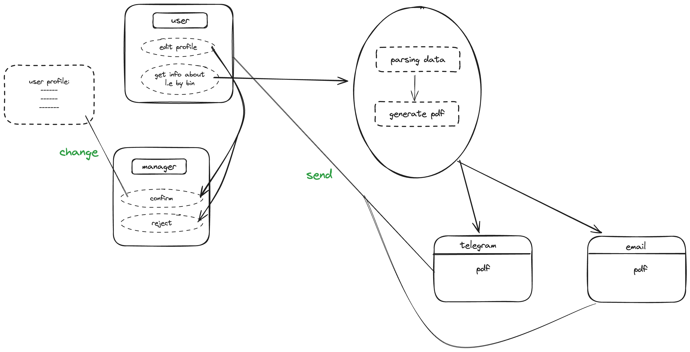

# _eGov PROJECT_


## Description

Our eGov project aims to revolutionize the way government services are accessed and delivered, leveraging digital technologies for enhanced efficiency, accessibility, and transparency. Through a user-centric approach, we strive to streamline interactions between citizens and government agencies, making public services more convenient and responsive to individual needs.

## Detailed description




## Group of developers
| Full name , ID| Responsible for  | 
| ------ | ------ |
| Amantai Aitolkyn , 21B030773 | backend, frontend, kafka, alembic, docker |
| Amangeldi Amina , 21B031086 | backend, frontend, kafka, alembic,  kafka library|
| Naryshov Ernar, 20B030306 | backend, telegram bot, email, makefile, CI/CD |

## INSTALL/RUN
#### _1 step_:
```sh
git clone https://gitlab.com/di-halyk-academy-adv-python-tima/egov-project.git
```
#### _2 step_:
```sh
make build
```
#### _3 step_:
```sh
make start
```
## CONTRIBUTING

### Reporting Bugs/Issues
If you encounter any bugs or issues, please follow these steps:
1. **Check Existing Issues:** Ensure the problem hasn't already been reported.
2. **Provide Details:** Clearly describe the issue, including steps to reproduce it.
3. **Attach Context:** Include relevant system details (OS, browser, version, etc.).
4. **Create an Issue:** Submit a new issue in the repository's issue tracker.

### Guideline for Contributing
We welcome contributions to improve this project. To contribute:
1. **Fork the Repository:** Create your copy of the repository.
2. **Branch:** Create a new branch for your feature/fix.
3. **Code:** Make changes, following coding conventions and ensuring tests pass.
4. **Commit:** Commit your changes with clear and descriptive messages.
5. **Push:** Push your changes to your forked repository.
6. **Pull Request:** Open a pull request, clearly outlining your changes and purpose.

### Code of Conduct
Please adhere to our project's [Code of Conduct](link/to/code_of_conduct.md) to maintain a respectful and inclusive community.

## Interesting Features

### _Telegram Integration_
- **Real-time Updates:** Receive notifications and results directly on Telegram for your requests.
- **Interactive Bot:** Interact with our Telegram bot to request and receive specific information seamlessly.

### _Email Notifications_
- **Personalized Alerts:** Get important updates and results delivered to your email inbox.
- **Customizable Preferences:** Tailor your notification settings to receive information that matters most to you.

These features enable convenient and flexible ways for users to stay updated and receive requested information promptly via their preferred communication channels.
